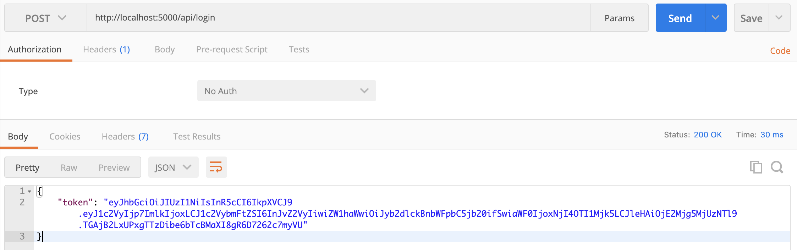

# Create web service with express and jwt

- create token
- verify token including expire time
- return status code 403 for invalid token

documentation on jsonwebtoken
https://github.com/auth0/node-jsonwebtoken


## install packages
```
$ npm install express jsonwebtoken
```
```
for debugging during development and set it in global
$ npm install -g nodemon
```

## start service
```
node app.js
or 
nodemon app.js
```

## Screenshots

1. Generate token


2. Valid token


3. Invalid token

